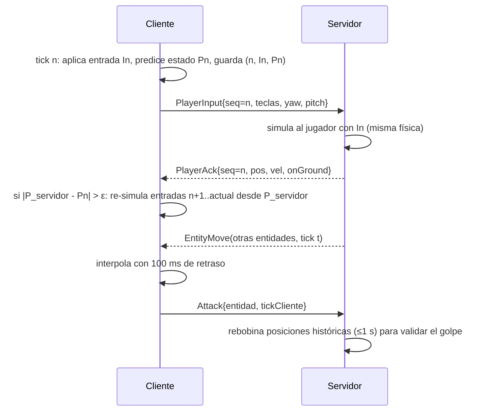
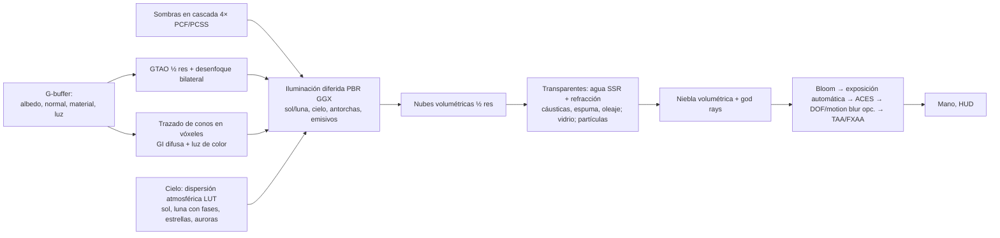

# STRATA — Documento de Diseño Técnico

> Sandbox de vóxeles para navegador. Mecánicas equivalentes a un sandbox de supervivencia
> "Java Edition" moderno, con **todos los recursos originales** (texturas, modelos, sonidos,
> música, textos y nombres propios generados proceduralmente o escritos desde cero).
> Ver [GLOSSARY.md](GLOSSARY.md) para la tabla de equivalencias de nombres.

---

## 1. Visión y pilares

| Pilar | Qué significa en código |
|---|---|
| **Fidelidad de mecánicas** | Ticks a 20 TPS, física por tick con las mismas constantes (gravedad 0.08, arrastre 0.98, fricción 0.6·0.91…), redstone con potencia fuerte/débil, cuasi-conectividad y BUD, fluidos por niveles, IA por metas. |
| **Todo original** | Texturas 16×16 y HD 128×128 generadas por código (`client/render/textures`), sonidos y música sintetizados con Web Audio (`client/audio`), modelos de cajas propios, nombres propios para términos acuñados. |
| **Navegador primero** | Un sitio estático (Vite). WebGPU con retroceso automático a WebGL2. Web Workers para servidor, generación y mallado. IndexedDB para guardado. |
| **Arquitectura cliente/servidor siempre** | Incluso en un jugador, la simulación corre en un *servidor integrado* dentro de un Worker. El mismo código corre en Node como servidor dedicado. |
| **Determinismo** | Misma semilla ⇒ mismo mundo, bit a bit, en TS y en WASM (solo aritmética IEEE-754 sin funciones trascendentes en la ruta de ruido). |

---

## 2. Modelo de procesos e hilos

```mermaid
flowchart LR
  subgraph Main["Hilo principal (cliente)"]
    UI[UI DOM + HUD]
    IN[Entrada: teclado/ratón, mando, táctil]
    CW[ClientLevel\ncaché de chunks]
    PRED[Predicción del jugador\n(misma física que el servidor)]
    MM[MeshManager]
    R[Renderer\nRHI WebGPU | WebGL2]
    AU[Audio Web Audio]
  end
  subgraph SW["Worker: servidor integrado"]
    SRV[StrataServer 20 TPS]
    LV[ServerLevel × 3 dimensiones]
    ECS[ECS entidades + IA]
    RS[Redstone / fluidos / ticks]
    LE[Motor de luz BFS]
    ST[Almacenamiento regiones\nIndexedDB]
  end
  subgraph GW["Workers de generación (N)"]
    G1[Ruido + densidad + superficie + cuevas]
  end
  subgraph MW["Workers de mallado (M)"]
    M1[Greedy meshing + AO + modelos]
  end
  UI --> IN --> PRED
  PRED -- "paquetes C2S (binario)" --> SRV
  SRV -- "paquetes S2C (binario)" --> CW
  SRV <-- "MessagePort" --> G1
  CW --> MM <-- "transferables" --> M1
  MM --> R
  SRV --> ST
```

* **Servidor integrado**: `src/workers/server.worker.ts` instancia `StrataServer`. El hilo
  principal crea también los workers de generación y les entrega un `MessagePort` hacia el
  servidor (`MessageChannel`), por lo que no dependemos de workers anidados (Safari).
* **Servidor dedicado**: `server-node/main.ts` instancia el mismo `StrataServer` con
  almacenamiento en disco (archivos de región reales) y transporte WebSocket (`ws`).
  Los workers de generación se sustituyen por `worker_threads` con el mismo módulo.
* **P2P**: el anfitrión expone su servidor integrado por `RTCDataChannel`; la señalización
  es manual (códigos copiables comprimidos) o a través del servidor dedicado (`/signal`).
* **Transporte**: la interfaz `Connection` (`common/net/connection.ts`) tiene 3
  implementaciones: `WorkerConnection`, `WebSocketConnection`, `RtcConnection`. Todos los
  paquetes se serializan a binario (`ByteWriter`/`ByteReader`) para que el protocolo local
  y el remoto sean idénticos y probados por igual.

### Reparto de workers

```
hc = navigator.hardwareConcurrency (mín. 2)
generación = clamp(floor(hc/2) - 1, 1, 6)
mallado    = clamp(floor(hc/4),     1, 4)
servidor   = 1
```

---

## 3. Estructura de carpetas

```
/
├─ docs/                 DESIGN.md, GLOSSARY.md, AUDIT.md, MILESTONES.md
├─ index.html            punto de entrada Vite
├─ public/wasm/          strata_native.wasm precompilado (Rust)
├─ native/               crate Rust → WASM (ruido SIMD, mallado, A*)
├─ scripts/              build-wasm.mjs y utilidades
├─ server-node/          servidor dedicado (Node + ws)
├─ src/
│  ├─ common/            CÓDIGO COMPARTIDO (sin DOM): corre en main, workers y Node
│  │  ├─ math/           vec/mat, AABB, frustum, hash, PRNG, ruido Perlin/Simplex
│  │  ├─ util/           ByteWriter/Reader, compresión, colas, LRU, i18n base
│  │  ├─ block/          propiedades, registro de estados, formas, materiales, comportamientos
│  │  ├─ item/           objetos, pilas, herramientas, armaduras, comida
│  │  ├─ recipe/         crafteo (con forma/sin forma/especiales), hornos, cortapiedras, herrería, pociones
│  │  ├─ world/          Chunk, Section (paleta), heightmaps, luz, acceso a mundo, direcciones
│  │  ├─ worldgen/       router de ruido, clima, biomas, superficie, cuevas, carvers, features, estructuras
│  │  ├─ entity/         ECS, componentes, física de movimiento, tipos de entidad
│  │  ├─ ai/             metas (goals), navegación A*, sensores, cerebros especiales
│  │  ├─ loot/ enchant/ effect/ potion/ advancement/ stats/
│  │  ├─ net/            protocolo (paquetes), conexión abstracta
│  │  └─ lang/           es.ts, en.ts
│  ├─ server/            simulación autoritativa (Worker o Node)
│  │  ├─ level/          ServerLevel, gestor de chunks, ticks programados, eventos de bloque
│  │  ├─ redstone/ fluid/ entity/ player/ command/ storage/ village/ raid/ dragon/
│  ├─ client/            solo navegador
│  │  ├─ render/         rhi/(webgl2, webgpu), passes/, shaders/, mesh/, textures/, entity/, particles/
│  │  ├─ audio/          motor 3D HRTF, síntesis de efectos, música generativa
│  │  ├─ ui/             pantallas DOM (menús, inventarios, chat, F3, créditos…)
│  │  ├─ input/          teclado/ratón, mando, táctil, reasignación
│  │  └─ net/            conexiones cliente (worker, ws, webrtc)
│  └─ workers/           server.worker.ts, gen.worker.ts, mesh.worker.ts
└─ tests/
   ├─ unit/              Vitest
   └─ e2e/               Playwright
```

---

## 4. Mundo y datos

### 4.1 Coordenadas y chunks
* Chunk = columna 16×16 × altura de la dimensión. Superficie: Y ∈ [-64, 320) → 24 secciones.
  Ínfero y Confín: Y ∈ [0, 256) → 16 secciones.
* `Section` (16³) usa un **contenedor con paleta adaptativo**:
  `SINGLE` (un único estado, sin array) → `PALETTE8` (≤256 estados, índices `Uint8Array`) →
  `DIRECT16` (`Uint16Array` de ids globales). La serialización a red/disco usa paleta con
  bits por entrada mínimos (4–8) o directo (16).
* Biomas a resolución 4×4×4 (64 por sección), como índices de bioma.
* Luz por sección: `Uint8Array(4096)` con `cielo<<4 | bloque`, o valor uniforme sin array.
* Heightmaps por columna: `MOTION_BLOCKING`, `WORLD_SURFACE`, `OCEAN_FLOOR` (Int16).

### 4.2 Estados de bloque
Cada bloque declara propiedades ordenadas (`facing`, `half`, `waterlogged`, `power`, …).
Los estados se numeran de forma contigua: `estado = base + Σ índice_i · stride_i`.
Tablas planas indexadas por estado (rápidas en bucles calientes):

| Tabla | Tipo | Uso |
|---|---|---|
| `stateBlock` | `Uint16Array` | estado → id numérico de bloque |
| `stateFlags` | `Uint32Array` | opaco, cubo completo, aire, líquido, reemplazable, ticks aleatorios, conductor, emisor… |
| `stateLight` | `Uint8Array` | emisión 0–15 |
| `stateOpacity` | `Uint8Array` | atenuación de luz 0–15 |
| `stateShape` | `Uint16Array` | id de forma de colisión (lista de AABB) |

Actualizaciones al estilo "Java": **shape updates** (`updateShape` al cambiar un vecino, usado
por escaleras, vallas, puertas, plantas, observadores) y **block updates**
(`neighborChanged`, usado por redstone, pistones, arena que cae). Los pistones y
dispensadores comprueban potencia en `pos` y `pos.above()` ⇒ cuasi-conectividad y BUD fieles.

### 4.3 Ciclo de vida de un chunk en el servidor

```mermaid
stateDiagram-v2
  [*] --> EMPTY
  EMPTY --> STRUCTURE_STARTS: calcular inicios de estructuras (determinista, barato)
  STRUCTURE_STARTS --> NOISE: worker de generación\n(densidad, acuíferos, superficie, carvers)
  NOISE --> FEATURES: requiere 3×3 vecinos en NOISE\n(árboles, menas, plantas; escriben en 3×3)\n+ piezas de estructura recortadas al chunk
  FEATURES --> LIGHT: requiere 3×3 vecinos en FEATURES
  LIGHT --> FULL: entidades iniciales, block entities, listo para enviar
  FULL --> [*]: descarga (guardar si sucio)
```



Carga por prioridad en espiral: los tickets de jugador ordenan la cola por distancia al
jugador y por el cono de visión.

### 4.4 Luz
Motor BFS de dos colas (adición y eliminación) por canal (cielo, bloque). La luz de cielo
inicial se rellena por columnas desde el heightmap y luego se propaga lateralmente. Se envía
al cliente dentro del paquete del chunk y como `LightUpdate` por sección tras cambios.
La luz de color opcional se calcula en el cliente a partir de los emisores (cono de vóxeles).

### 4.5 Ticks (20 TPS)
Orden por tick de un nivel (igual que la referencia):
1. Borde del mundo / clima / tiempo.
2. Ticks programados de bloque (cola por `(tiempo, prioridad, orden)`), luego de fluido.
3. Asaltos.
4. Ticks de chunk: ticks aleatorios (`randomTickSpeed` por sección), rayos, nieve/hielo.
5. Eventos de bloque (pistones, notas, cofres) hasta vaciar la cola.
6. Entidades (jugadores primero, luego resto), block entities (hornos, tolvas…).

---

## 5. Generación del mundo

```mermaid
flowchart TD
  S[Semilla 64 bits] --> RNG[xoshiro128** + hash posicional]
  RNG --> CN[Ruidos de clima:\ntemperatura, humedad, continentalidad,\nerosión, rareza → picos/valles]
  CN --> SP[Modelador: altura suave, escala 3D,\ncrestas, ríos, humedales, mesetas]
  SP --> D[Densidad 3D en celdas 4×8×4\n+ queso + pilares + espagueti + fideos + entradas]
  D --> AQ[Acuíferos: celdas 16×12×16 con nivel\nmar / freático / lava / seco + barreras]
  D --> VE[Vetas grandes de cobre/hierro]
  CN --> BS[Selector de bioma de superficie\n+ biomas de cueva]
  AQ --> SR[Reglas de superficie por bioma\n(bordes de bioma con jitter)]
  BS --> SR
  SR --> CV[Carvers: túneles y cañones\n(caché por chunk de origen)]
  CV --> FE[Decorador: features por etapa y bioma]
  FE --> ST[Piezas de estructuras (H6)]
```

* **Clima** (`worldgen/overworld/climate.ts`): seis parámetros por columna a partir de
  `NormalNoise` con desplazamiento de dominio. Los umbrales, curvas (Hermite monótona) y la tabla
  de biomas son propios de STRATA; solo se comparte el enfoque multiparámetro.
* **Terreno** (`terrain.ts`): la densidad se evalúa en las esquinas de celdas 4×8×4 y se
  interpola trilinealmente. El ruido de detalle solo se calcula en la franja de la superficie y
  las cuevas solo en suelo sólido. Todas las muestras se agrupan por lotes (`sampleBatch`), que
  el núcleo WASM SIMD evalúa ~2,4× más rápido que TS con resultados **bit a bit idénticos**
  (`tests/unit/noise.test.ts`, `worldgen.test.ts`).
* **Acuíferos**: celdas con centro aleatorio; cada una tiene nivel de mar (cerca de océanos y
  ríos), nivel freático local, lava (por debajo de Y −40) o ninguno. Entre celdas con niveles
  distintos aparece una barrera de piedra.
* **Superficie** (`surface.ts`): hierba/tierra, arena y arenisca, bandas de terracota con
  chimeneas de hadas, nieve y hielo compacto en cumbres, calcita, fondos marinos (arena, grava,
  arcilla), barro, micelio, podsol… Las fronteras entre biomas usan un zoom con jitter.
* **Carvers** (`carvers.ts`): túneles serpenteantes con salas y cañones; cada sistema se calcula
  una vez por chunk de origen y se reutiliza para los 17×17 chunks que puede atravesar.
* **Decoración** (`features/`): framework de *placed features* (count, rarity, inSquare,
  heightmap, uniform/triangle/biased Y, surfaceWaterDepth, filtros) ejecutado por etapas en orden
  global estable. Incluye menas (con descarte por aire), manchas de piedra, discos, geodas,
  mazmorras con cofres y generador, fósiles, lagos de lava, manantiales, más de 20 tipos de
  árbol (con distancia de hojas correcta, lianas, cacao, nidos de abejas, hojarasca), flora por
  bioma, corales, algas, icebergs, pinchos de hielo, cuevas frondosas, espeleotemas, musgo de eco
  y la capa superior de nieve/hielo según temperatura y altitud.
* **Tipos de mundo**: `normal`, `flat` (capas configurables), `large_biomes`, `amplified`,
  `floating_islands`, `single_biome`, `debug` (todos los estados de bloque en rejilla) y
  `debug_simple` (colinas rápidas para pruebas).
* **Coste medido** (Node, WASM SIMD): ~4 ms por chunk de terreno en un worker y ~4,5 ms de
  decoración en el hilo del servidor.
* Herramientas: `npm run map -- <semilla> map.png` (mapa de clima) y
  `npm run genview -- <semilla> prefijo` (vista cenital y corte vertical con bloques reales).

---

## 6. Entidades (ECS) e IA

* `EntityWorld` con almacenes dispersos por componente (`Map<id, datos>`), consultas por
  conjuntos de componentes y sistemas ordenados: `Physics → Living → AI → Projectile →
  Item → Despawn`.
* Componentes principales: `Transform`, `Motion`, `Collider`, `Living` (salud, efectos,
  atributos, equipo), `Brain` (selector de metas + objetivo), `Navigation`, `Breedable`,
  `Tameable`, `Inventory`, `ItemEntity`, `Projectile`, `Rideable`, `Villager`…
* IA: metas con prioridad y bandas de control (`MOVE`, `LOOK`, `JUMP`, `TARGET`) igual que la
  referencia; A* 3D con tipos de nodo y costes por bloque (agua, lava, fuego, trampillas,
  puertas, vallas). Percepción: vista con raycast, sonido y **vibraciones** (sistema de
  eventos de juego con frecuencias 1–15 para sensores y el Guardián).
* Límites de población por categoría (`monster 70`, `creature 10`, `ambient 15`,
  `water_creature 5`, `water_ambient 20`, `underground_water_creature 5`, `axolotls 5`),
  escalados por chunks cargados como en la referencia.

---

## 7. Física del jugador y entidades
Movimiento por tick con barrido AABB por ejes (Y, luego el eje horizontal mayor), subida de
escalón 0.6, borde al agacharse, gravedad 0.08, arrastre vertical 0.98, fricción horizontal
`deslizamiento × 0.91`, aceleración `velocidad × 0.216/fricción³` en suelo, 0.02 en aire.
Agua (arrastre 0.8, gravedad 0.02), lava (0.5), escaleras de mano, telarañas, polvo de nieve,
bayas, miel (0.4 velocidad, 0.5 salto), alma (0.4), hielo (0.98), hielo azul (0.989),
slime (rebote), élitros (fórmula vectorial de planeo con cohetes), empuje de fluidos y
knockback. El cliente usa **exactamente el mismo código** para predecir al jugador local.

---

## 8. Red: autoridad, predicción, interpolación y compensación



---

## 9. Renderizado

### 9.1 RHI
`client/render/rhi` define una interfaz mínima (buffers, texturas 2D/array/3D, samplers,
pipelines, pases, bind groups, uniformes por *slots* de 256 B con offset dinámico) y dos
backends: `WebGPUDevice` (WGSL) y `WebGL2Device` (GLSL ES 3.00). Los pases se escriben una
vez contra la RHI; cada shader existe en ambos lenguajes (`shaders/*.ts` exporta
`{ glsl: {vs, fs}, wgsl }`).

### 9.2 Mallado
* Worker recibe un volumen acolchado 18×18×18 (estados + luz) y genera dos mallas:
  **opaca/recorte** y **translúcida** (agua, hielo, vidrio tintado).
* Caras de cubo: *greedy meshing* por capa y dirección, fusionando sólo caras con misma
  textura, tinte, AO y luz en sus 4 vértices; AO por vértice (3 vecinos) y luz suave
  (promedio de 4 muestras) como la referencia. Las texturas repiten gracias a
  `texture_2d_array` + UV > 1.
* Modelos no cúbicos por elementos (cajas `from/to` en 1/16, rotación por eje): escaleras,
  losas, vallas, muros, paneles, puertas, trampillas, antorchas, plantas en cruz, cultivos,
  raíles, polvo de flujo, repetidores, comparadores, camas, cofres, yunques, calderos…
* Vértice de 20 bytes: posición (3×u16), capa de textura (u16), UV (2×u16), color/tinte+AO
  (4×u8), normal+flags (u8), luz (u8), material (u8), relleno (u8).
* LOD: más allá de la distancia de renderizado, anillos de "horizonte lejano" con
  columnas de altura/color a 1/4 y 1/8 de resolución.

### 9.3 Pipeline "Ultra" (diferido)



Preajustes: **Bajo** (clásico forward, sin post), **Medio** (sombras 1 cascada, FXAA),
**Alto** (diferido, 3 cascadas, SSAO, SSR agua, nubes ½ res), **Ultra** (4 cascadas PCSS,
GTAO, GI por vóxeles 64³, niebla volumétrica, TAA), **Sin límites** (GI 128³, nubes y
niebla a resolución completa, más muestras). **Modo clásico** = sin shaders avanzados.

### 9.4 Texturas procedurales
`client/render/textures` genera cada textura con una gramática de materiales (ruido de
valor/Worley, vetas de madera, ladrillos, puntos de mena, tejidos…) y paletas propias. El
paquete HD (128×128) usa el mismo generador a mayor resolución. Normales y especular (PBR)
se derivan de un mapa de altura por textura (formato propio inspirado en "LabPBR":
rugosidad, F0/metal, emisión, porosidad).

---

## 10. Audio
Grafo Web Audio: fuentes → `PannerNode` (HRTF) → bus SFX → reverb por convolución (IR
generada) con mezcla según "cerramiento" estimado por rayos → compresor → salida.
Efectos 100% sintetizados (ruido filtrado + envolventes + osciladores con formantes) por
material y criatura. Música generativa por dimensión/bioma (escalas modales, pads,
arpegios FM, piano sintético), tema del jefe y de créditos.

---

## 11. Guardado
* IndexedDB `strata-worlds`: almacén `worlds` (metadatos), `regions` (clave
  `mundo/dim/r.x.z`), `players`.
* Región tipo Anvil: 32×32 chunks, cabecera de 4 KiB de offsets + 4 KiB de marcas de tiempo,
  sectores de 4 KiB; carga útil `[longitud u32][compresión u8][datos deflate]`.
* Autoguardado cada 6000 ticks (5 min) y al pausar/salir. Exportar/importar como `.zip`
  (método *store*, CRC32) con `level.json`, `players/*.json` y `region/*.mca`.

---

## 12. Rendimiento y memoria

| Subsistema (presupuesto @60 FPS, 16.6 ms) | Objetivo |
|---|---|
| Entrada + predicción + red | ≤ 0.5 ms |
| Subida de mallas (máx. N por frame) | ≤ 1.5 ms |
| Culling (frustum + cuevas) | ≤ 0.7 ms |
| Sombras | ≤ 3 ms |
| G-buffer | ≤ 3 ms |
| Iluminación + AO + GI | ≤ 4 ms |
| Transparentes + post | ≤ 3 ms |
| UI | ≤ 0.5 ms |

Memoria: secciones paletizadas (~4 KiB típicas), mallas en GPU liberadas al descargar,
pools de buffers de trabajo reutilizados; el perfilador integrado (`F3` + `Shift+F3`)
muestra el tiempo por subsistema y contadores de chunks/mallas/entidades para detectar fugas.

---

## 13. Plan por hitos
Ver [MILESTONES.md](MILESTONES.md) para el estado detallado de cada hito.

| Hito | Contenido | Criterio de aceptación |
|---|---|---|
| H1 | RHI (WebGPU+WebGL2), chunks, mallado, cámara, física, servidor integrado | Se camina por un mundo generado, se rompen y colocan bloques a 60 FPS |
| H2 | Generación completa y biomas | Semillas deterministas, biomas, cuevas, menas, árboles |
| H3 | Jugador, inventario, crafteo, supervivencia | Ciclo madera→piedra→hierro→diamante jugable |
| H4 | Criaturas e IA | Mobs pasivos/hostiles con IA, drops, cría |
| H5 | Redstone, fluidos, bloques funcionales | Relojes, pistones, granjas básicas funcionan |
| H6 | Ínfero y estructuras | Portales, fortalezas, bastiones, estructuras de superficie |
| H7 | El Confín, dragón, créditos y poema | Partida completa hasta créditos |
| H8 | Aldeanos, comercio, asaltos, encantamientos, pociones | Economía y magia completas |
| H9 | Gráficos ultra y audio | Preajustes Bajo→Sin límites |
| H10 | Multijugador, pulido, optimización, pruebas | Servidor dedicado + P2P, tests verdes |
